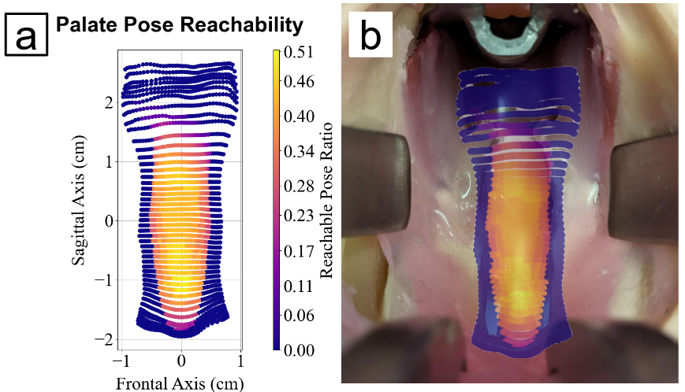

# reachability-analysis
This repository contains Python scripts used to optimize the placement of the daVinci Research Kit (dVRK) for cleft palate repair. Some publications associated with this work can be found at !(https://ieeexplore.ieee.org/document/10854906) and !(https://hdl.handle.net/1807/150343). I suggest checking these sources for a more comprehensive review of the method as well as experimental results.

## Mathematical Background
The main idea of this work was to utilize the **Reachability Index** which quantifies how easily a given point in the workspace can be reached from a known robot base position. 

In plain terms, the **Reachability Index** **C** is defined as follows: C = (number of collision free poses)/(total number of tested poses). To calculate C, inverse kinematics is computed 125 times for each target point in the surgical workspace with continuously varying orientations. A pose is said to result in a collision if any part of the robot arm intersects with obstacle geometry or if the robot violates its joint constraints by assuming the sample pose.

Once the **Reachability Index** is calculated for the entire workspace, averaging these values yields the **Global Reachability Index** which gives a rough estimation of how good a robot base position is. By calculating the **Global Reachability Index** multiple times, we can optimize the robot base pose. While it was not implemented in this code, a good next step would be to implement a formal optimization algorithm like simulated annealing to improve search efficiency.

An example of the target reachability overlayed a cleft palate model can be seen here: 

## Why Reachability?
For those who are familiar with workspace optimization, you may be familiar with other optimization indices like the **Manipulability Index**, **Global Isotropy Index**, **Condition Number**, etc. many of which rely upon the robot Jacobian and its determinant. While these were considered as optimization indices, they were not appropriate for this task for a few reasons which had to do with the specifics of the kinematic makeup of the dVRK itself. In short, robot configurations within the infant oral cavity never approached singularities rendering any performance indices associated with the robot Jacobian useless. The condition number was seen to vary between different robot poses, but this was due to the significant imbalance between prismatic and revolute actuators and was not a result of kinematic instability.

Instead, the **Global Reachability Index** was more relevant to the problem formulation and generated the most sensible results.
